# Genesis 5–11 Chronology Witness Comparison Chart: MT vs LXX

**Project:** The Bible Video Game  
**Research use:** Scripture-backed codex chronology, primeval timeline modeling, textual-witness comparison  
**Scope:** Genesis 5 and Genesis 11 genealogical chronology from Adam to Abram  
**Witnesses compared:** Masoretic Text / Leningrad tradition and Septuagint / LXX tradition  
**Created:** 2026-06-30  

---

## 1. Method Note

This chart compares the **Masoretic Text / Leningrad Codex tradition** and the **Septuagint / LXX tradition** for the chronological genealogies in **Genesis 5** and **Genesis 11**.

Important caution:

- The project currently has OCR-derived text files for both witnesses:
  - `Leningrad_Codex_OCR.txt`
  - `Septuagint_LXX.txt`
- The **LXX OCR was usable enough** to confirm the broad Genesis 5 and Genesis 11 chronology pattern.
- The **Leningrad OCR is badly corrupted in the early Genesis pages**, so the MT values below should be treated as **standard Masoretic/Leningrad chronology values**, not as clean automated extraction from the OCR file.
- All values should eventually be manually verified against a clean critical edition or digital transcription before being promoted to authoritative database status.

Codex principle:

> Do not collapse MT and LXX into one fake-clean timeline. Store them as parallel textual-witness chronology tracks.

---

# 2. Genesis 5 Chart — Adam to Noah

| Patriarch | Named Son | MT Age at Son | LXX Age at Son | Difference | MT Remaining Years | LXX Remaining Years | MT Total Lifespan | LXX Total Lifespan |
|---|---:|---:|---:|---:|---:|---:|---:|---:|
| Adam | Seth | 130 | 230 | +100 | 800 | 700 | 930 | 930 |
| Seth | Enosh | 105 | 205 | +100 | 807 | 707 | 912 | 912 |
| Enosh | Kenan / Cainan | 90 | 190 | +100 | 815 | 715 | 905 | 905 |
| Kenan / Cainan | Mahalalel | 70 | 170 | +100 | 840 | 740 | 910 | 910 |
| Mahalalel | Jared | 65 | 165 | +100 | 830 | 730 | 895 | 895 |
| Jared | Enoch | 162 | 162 | same | 800 | 800 | 962 | 962 |
| Enoch | Methuselah | 65 | 165 | +100 | 300 | 200 | 365 | 365 |
| Methuselah | Lamech | 187 | 167 | -20 | 782 | 802 | 969 | 969 |
| Lamech | Noah | 182 | 188 | +6 | 595 | 565 | 777 | 753 |
| Noah | Shem / Ham / Japheth | 500 | 500 | same | — | — | 950 | 950 |

## Genesis 5 Timeline Markers

| Marker | MT Track | LXX Track, Current OCR Reading | Notes |
|---|---:|---:|---|
| Adam to Seth | AM 130 | AM 230 | LXX adds 100 years before Seth |
| Adam to Noah's birth | AM 1056 | AM 1642 | LXX substantially lengthens pre-Flood period |
| Noah's age at Flood | +600 | +600 | Same in both tracks |
| Adam to Flood | **AM 1656** | **AM 2242** | Based on LXX Methuselah age-at-Lamech = 167 |

### Genesis 5 Special Note: Methuselah

The LXX Methuselah figure is a known chronology pressure point. The current OCR witness reflects the **167-year** LXX form for Methuselah begetting Lamech. Some LXX-related traditions/readings use **187**, which would shift the LXX Flood date **20 years later**, from **AM 2242** to **AM 2262**.

For the codex, this should be stored as a variant note, not silently resolved.

---

# 3. Genesis 11 Chart — Shem to Terah / Abram

| Patriarch | Named Son | MT Age at Son | LXX Age at Son | Difference | MT Remaining Years | LXX Remaining Years | MT Total Lifespan | LXX Total Lifespan |
|---|---:|---:|---:|---:|---:|---:|---:|---:|
| Shem | Arpachshad / Arphaxad | 100 | 100 | same | 500 | 500 | 600 | 600 |
| Arpachshad / Arphaxad | Shelah / Cainan | 35 | 135 | +100 | 403 | 430 | 438 | 565 |
| **Cainan** | Shelah | — | 130 | LXX adds generation | — | 330 | — | 460 |
| Shelah | Eber | 30 | 130 | +100 | 403 | 330 | 433 | 460 |
| Eber | Peleg | 34 | 134 | +100 | 430 | 370 | 464 | 504 |
| Peleg | Reu | 30 | 130 | +100 | 209 | 209 | 239 | 339 |
| Reu | Serug | 32 | 132 | +100 | 207 | 207 | 239 | 339 |
| Serug | Nahor | 30 | 130 | +100 | 200 | 200 | 230 | 330 |
| Nahor | Terah | 29 | 79 | +50 | 119 | 129 | 148 | 208 |
| Terah | Abram / Nahor / Haran | 70 | 70 | same headline age | — | — | 205 | 205 |

## Genesis 11 Timeline Markers

| Marker | MT Track | LXX Track, Current OCR Reading | Notes |
|---|---:|---:|---|
| Flood | AM 1656 | AM 2242 | LXX based on Methuselah-167 reading |
| Arpachshad / Arphaxad born, 2 years after Flood | AM 1658 | AM 2244 | Genesis 11:10 |
| Terah born | AM 1878 | AM 3244 | LXX includes added Cainan and +100 pattern |
| Abram born, simple Terah-70 reading | AM 1948 | AM 3314 | Treat cautiously; Genesis 11:26 names Abram first but may not imply birth order |
| Abram born, Terah-130 harmonization | **AM 2008** | **AM 3374** | Harmonizes Genesis 11:32, Genesis 12:4, and Acts 7:4 |

### Genesis 11 Special Note: Cainan

The LXX includes a post-Flood **Cainan** between Arphaxad and Shelah. The Masoretic Text does not include this generation in Genesis 11.

This matters because Luke 3:36 also includes Cainan in Jesus' genealogy, aligning with the LXX-style tradition at that point.

For the codex, this should be flagged as a major textual-witness difference:

> MT: Arpachshad → Shelah  
> LXX: Arphaxad → Cainan → Shelah

---

# 4. Visual Timeline Chart

```mermaid
xychart-beta
    title "Genesis 5–11 AM Chronology: MT vs LXX"
    x-axis ["Flood", "Terah born", "Abram born, simple Terah-70", "Abram born, Terah-130 harmonized"]
    y-axis "Anno Mundi year" 0 --> 3600
    bar "MT" [1656, 1878, 1948, 2008]
    bar "LXX current OCR" [2242, 3244, 3314, 3374]
```



If the Mermaid chart does not render in a given markdown viewer, use the table below as the same data in static chart form.

| Event | MT AM | LXX AM, Current OCR | LXX Difference from MT |
|---|---:|---:|---:|
| Flood | 1656 | 2242 | +586 |
| Terah born | 1878 | 3244 | +1366 |
| Abram born, simple Terah-70 | 1948 | 3314 | +1366 |
| Abram born, Terah-130 harmonized | 2008 | 3374 | +1366 |

---

# 5. Codex-Ready Summary

## Short Version

The Masoretic and Septuagint traditions preserve **significantly different primeval chronologies**.

- The **MT track** places the Flood at **AM 1656**.
- The **LXX track**, using the current OCR's Methuselah-167 reading, places the Flood at **AM 2242**.
- The **MT track** places Abram around **AM 2008** under the Terah-130 harmonization.
- The **LXX track** places Abram around **AM 3374** under the same harmonization.

## Recommended Codex Label

> The Masoretic/Leningrad chronology places the Flood at AM 1656 and Abram around AM 2008 under a Terah-130 harmonization. The Septuagint chronology, using this OCR witness's Methuselah-167 form, places the Flood at AM 2242 and Abram around AM 3374. A known LXX Methuselah-187 variant shifts the LXX line about 20 years later.

---

# 6. Recommended Database Shape

Do **not** store one single hard date for primeval chronology. Store multiple witness tracks.

Example:

```yaml
event: Flood
scripture_range: Genesis 6-9
relative_years:
  mt_leningrad: 1656
  lxx_current_ocr_methuselah_167: 2242
  lxx_variant_methuselah_187: 2262
absolute_bce: null
confidence:
  event_order: high
  internal_textual_chronology: high
  absolute_date: low / disputed
notes:
  - Genesis 5 and 11 differ significantly across textual witnesses.
  - MT and LXX should be stored as parallel chronology tracks.
  - Current LXX OCR reflects Methuselah age-at-Lamech as 167.
  - MT OCR from early Genesis is corrupted and requires manual verification.
```

Example:

```yaml
event: Abram born
scripture_range: Genesis 11:26-32; Genesis 12:4; Acts 7:4
relative_years:
  mt_simple_terah_70: 1948
  mt_terah_130_harmonized: 2008
  lxx_simple_terah_70_current_ocr: 3314
  lxx_terah_130_harmonized_current_ocr: 3374
absolute_bce: null
confidence:
  event_order: high
  internal_textual_chronology: medium-high
  exact_birth_order_from_genesis_11_26: debated
notes:
  - Genesis 11:26 lists Abram, Nahor, and Haran after saying Terah was 70.
  - Genesis 11:32, Genesis 12:4, and Acts 7:4 are often harmonized to place Abram's birth when Terah was 130.
```

---

# 7. Game Design Use

For the player-facing codex:

- Show **one clean narrative order**: Adam → Seth → Noah → Flood → Shem → Abraham.
- Provide a **textual witness toggle** or codex note for MT vs LXX chronology.
- Avoid presenting a single BCE date for Creation, the Flood, or Abraham as if all witnesses agree.
- Use phrasing like:

> Scripture gives a real sacred sequence, but the preserved manuscript traditions differ in the numerical chronology of Genesis 5 and 11. The codex therefore presents MT and LXX chronology tracks separately.

For internal game planning:

- Treat primeval chronology as **Anno Mundi-relative**, not BCE-locked.
- Use external BCE anchoring only later, where archaeological and ancient historical synchronisms become stronger.
- Keep sacred events fixed in order, while allowing chronology notes to remain transparent and reverent.

---

# 8. Next Research Step

The next table should add:

1. **Samaritan Pentateuch** Genesis 5 and 11 values.
2. **Josephus** as an early Jewish chronological witness.
3. Major early Christian chronographers where relevant, especially where they follow LXX-style longer chronology.
4. A database-ready `chronology_witnesses` table with `event_id`, `witness`, `am_year`, `variant_note`, and `confidence`.
